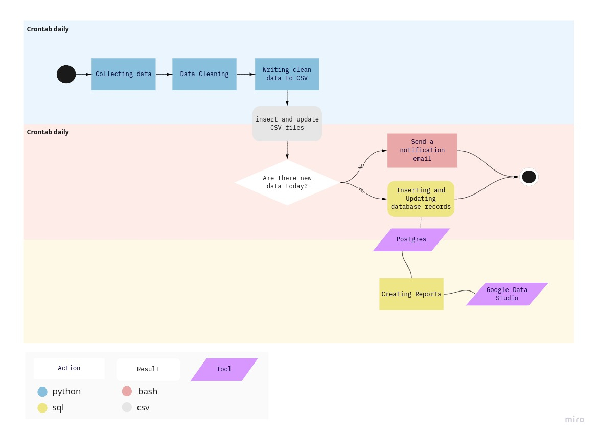

#  😷 COVID 2019 📉 💉

This project has the final goal to create a report with COVID19 data taken from [European Centre for Disease Prevention and Control (ECDC)](https://www.ecdc.europa.eu/en) and [Brasil.IO](https://brasil.io/home/).
The first dataset was used to see the number of cases and deaths around the world. On the other hand, Brasil.IO API was used to get data from Brazil in state level, as ECDC does not provide information on this level.

❗️<b>Important: </b> 
I'm not an epidemiologist, virologist or even work on health area. I'm just exploring data, learning how to do that using Python, SQL, and Google Data Studio. So I'll not draw conclusions on that level nor base behavior or policy upon these explorations and neither should you.

## Tasks
- Getting the data and load it into dataframes
- Preparing the dataset
  - Normalizing column names
  - Feature Selection
  - Feature Engineering: creating new features
  - Data Cleaning: correcting country names, filling NaN values, changing data types
- Generating CSV files to insert and update the data in a Postgres database
- Update the database
- Create report on Google Data Studio with Postgres database as data source

## Stack
- Python: Pandas, datetime, requests, io, gzip
- Postgres
- Jupyter Notebook
- Google Data Studio

## To do
- [ ] Improve the graphs using number of cases per habitants  
- [ ] Use PEP8

## Process Workflow

